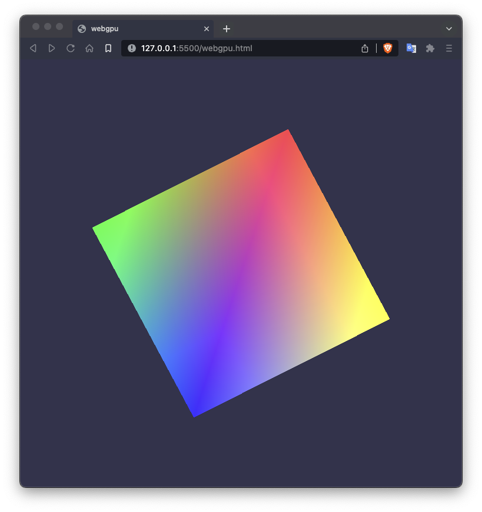

<div align="center">
<h1>webgpu-wasm-zig</h1>

<p>A minimal WebGPU example written in Zig, compiled to WebAssembly (wasm).</p>


  


</div>

## Getting started

### Clone

```bash
git clone https://github.com/seyhajin/webgpu-wasm-zig.git
```

Alternatively, download [zip](https://github.com/seyhajin/webgpu-wasm-zig/archive/refs/heads/master.zip) from Github repository and extract wherever you want.

### Build

Build the example with `zig build` command, which will generate 3 new files (`.html`, `.js`, `.wasm`).

#### Command
```
zig build --sysroot [path/to/emsdk]/upstream/emscripten/cache/sysroot
```

##### macOS + brew
Example with Emscripten installed with Homebrew (`brew install emscripten`, v4.0.8) on macOS :
```
zig build --sysroot /usr/local/Cellar/emscripten/4.0.8/libexec/cache/sysroot
```
Or automatically search for the active version :
```
zig build --sysroot `readlink -f $(brew --prefix emscripten)`/libexec/cache/sysroot
```

##### linux + pixi

1. install [pixi](https://pixi.sh)

2. download latest [binaryen-linux.conda](https://github.com/AClon314/binaryen-feedstock/releases) and [emscripten-linux.conda](https://github.com/AClon314/emscripten-feedstock/releases)
   because newer versions of them aren't available on conda-forge. (windows/macOS need build these 2 conda file by `conda-build .`)

3. If you want to install them in global space *(pixi prefer install for each repo in `./.pixi`, but I like install in global like conda)*
   Copy conda files to `~/.pixi/conda-files`, and add these lines to `~/.pixi/manifests/pixi-global.toml`:
```toml
[envs.emscripten]
channels = ["conda-forge"]
dependencies = {binaryen = {path = "../conda-files/binaryen-125-hec23631_0.conda"}, emscripten = {path = "../conda-files/emscripten-4.0.22-h1f94ec8_0.conda"}}
exposed = {wasm-as = "wasm-as", wasm-ctor-eval = "wasm-ctor-eval", wasm-dis = "wasm-dis", wasm-emscripten-finalize = "wasm-emscripten-finalize", wasm-fuzz-lattices = "wasm-fuzz-lattices", wasm-fuzz-types = "wasm-fuzz-types", wasm-merge = "wasm-merge", wasm-metadce = "wasm-metadce", wasm-opt = "wasm-opt", wasm-reduce = "wasm-reduce", wasm-shell = "wasm-shell", wasm-split = "wasm-split", wasm2js = "wasm2js", "emcc" = "emcc", "em++" = "em++"}
```

4. run `pixi global sync` (or `pixi i` if install in local repo)
5. build
```sh
zig build --sysroot ~/.pixi/envs/emscripten/lib/emscripten-4.0.22/cache/sysroot
```

> [!NOTE] 
> `build.zig` is preconfigured to build to `wasm32-emscripten` target only. 

> [!CAUTION] 
> Must provide Emscripten sysroot via `--sysroot` argument. 

### Run

Launch a web server to run example before open it to WebGPU compatible web browser (Chrome Canary, Brave Nightly, etc.).

e.g. : launch `python3 -m http.server` and open web browser to `localhost:8000`.

> [!TIP]
> Use [Live Server](https://marketplace.visualstudio.com/items?itemName=ritwickdey.LiveServer) extension in Visual Studio Code to open the HTML file. This extension will update automatically page in real-time when you rebuild the example.

## Prerequisites

* [zig](https://www.zig.org/download), works with Zig 0.14.0+ version
* [emscripten](https://emscripten.org), version 4.0+
* git (optional)
* python3 (optional)

